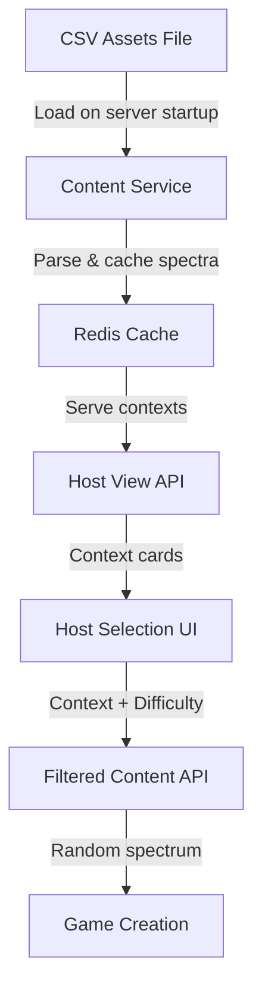

# Design Document

## Overview

The Dynamic Content System transforms Hivemind from using hardcoded spectrum data to a flexible, CSV-based content management approach. The system uses a CSV file stored in the assets folder for content management, with Redis caching for fast retrieval. This enables content managers to add new spectrum categories and difficulty levels by updating a CSV file and redeploying, while providing hosts with an intuitive selection experience through context cards and difficulty filters.

## Architecture

### Devvit Assets Configuration
The system uses Devvit's built-in assets folder for content management:

**Assets Structure:**
```
src/
├── client/
│   └── public/
│       └── assets/
│           └── content/
│               └── spectra.csv
```

**CSV File Format:**
```csv
ID,Context,Left_Label,Right_Label,Difficulty
coffee-vs-tea,Food,Coffee,Tea,Easy
cats-vs-dogs,Pets,Cats,Dogs,Easy
marvel-vs-dc,Movies,Marvel,DC,Medium
```

**No External Dependencies:**
- No Google Sheets API required
- No external HTTP fetch permissions needed
- No Terms and Conditions or Privacy Policy requirements
- Content updates require app redeployment via `devvit upload`

### High-Level Flow
```
CSV Assets File → Server Startup Load → Redis Cache → Context Selection UI → Filtered Content Delivery
```

### Component Interaction


## Components and Interfaces

### 1. CSV Assets Integration Layer

**Enhanced Content Service** (`src/server/core/services/content.service.ts`)
- Replaces Google Sheets integration with CSV file reading from assets
- Loads CSV content on server startup and caches in Redis
- Adds context aggregation and filtering capabilities
- Maintains backward compatibility with current spectrum cache

**New Functions:**
```typescript
export const loadSpectraFromAssets = async (): Promise<Spectrum[]>
export const getAvailableContexts = async (): Promise<string[]>
export const getFilteredSpectrum = async (context: string, difficulty: string): Promise<Spectrum>
export const getContextsWithCounts = async (): Promise<ContextSummary[]>
```

**CSV Assets Integration:**
```typescript
import { readFileSync } from 'fs';
import { join } from 'path';

const loadSpectraFromAssets = async (): Promise<Spectrum[]> => {
  try {
    // Read CSV file from assets folder
    const csvPath = join(process.cwd(), 'src/client/public/assets/content/spectra.csv');
    const csvContent = readFileSync(csvPath, 'utf-8');
    
    return parseCsvContent(csvContent);
  } catch (error) {
    console.warn('Failed to load spectra from assets, using fallback data');
    return TEMP_FALLBACK_SPECTRA;
  }
};

const parseCsvContent = (csvContent: string): Spectrum[] => {
  const lines = csvContent.trim().split('\n');
  const headers = lines[0].split(',');
  
  return lines.slice(1).map(line => {
    const values = line.split(',');
    return parseSpectrumRow(values);
  }).filter(Boolean);
};
```

**Enhanced Spectrum Type:**
```typescript
interface Spectrum {
  id: string;
  leftLabel: string;
  rightLabel: string;
  difficulty: SpectrumDifficulty;
  category: SpectrumCategory; // Maps to Context from sheets
}

interface ContextSummary {
  context: string;
  totalCount: number;
  difficultyBreakdown: Record<SpectrumDifficulty, number>;
}
```

### 2. API Layer Enhancement

**New Routes** (`src/server/core/routes/`)
```typescript
// GET /api/contexts - Returns available contexts with counts
// GET /api/spectrum/filtered?context={context}&difficulty={difficulty} - Returns random filtered spectrum
```

**Enhanced Draft API:**
- Modify existing `/api/draft` to accept optional context and difficulty parameters
- Maintain backward compatibility for random selection when no filters provided

### 3. Host Selection Interface

**Context Selection Component** (`src/client/components/ContextSelector.tsx`)
```typescript
interface ContextCard {
  context: string;
  displayName: string;
  totalCount: number;
  difficultyBreakdown: Record<SpectrumDifficulty, number>;
  icon?: string;
}
```

**Difficulty Selection Component** (`src/client/components/DifficultySelector.tsx`)
```typescript
interface DifficultyOption {
  level: SpectrumDifficulty;
  displayName: string;
  description: string;
  availableCount: number;
}
```

**Enhanced Host View** (`src/client/views/HostView/HostView.tsx`)
- Add context selection step before clue input
- Implement difficulty selection after context choice
- Maintain existing draft flow with enhanced filtering

### 4. Data Models

**CSV File Schema:**
```csv
ID,Context,Left_Label,Right_Label,Difficulty
1,Food,Coffee,Tea,Easy
2,Pets,Cats,Dogs,Easy
3,Movies,Marvel,DC,Medium
4,Weather,Summer,Winter,Easy
```

**Cache Structure (Redis-based):**
```typescript
interface EnhancedSpectrumCache {
  spectra: Spectrum[];
  fetchedAt: string;
}

// Separate Redis keys for efficient filtering
// redis:spectrum:cache - Main spectrum array
// redis:spectrum:contexts - Set of available contexts
// redis:spectrum:context:{contextName} - Spectra for specific context
// redis:spectrum:context:{contextName}:difficulty:{level} - Filtered spectra
```

## Error Handling

### CSV Assets Loading Failures
- **File Not Found:** Use fallback spectra with multiple contexts to demonstrate functionality
- **Parse Errors:** Skip malformed rows and log warnings, continue with valid data
- **Empty File:** Fall back to hardcoded spectra and log error

### Content Validation
- **Missing Required Fields:** Skip invalid rows and log warnings
- **Unknown Context Values:** Accept all non-empty strings to allow dynamic expansion
- **Invalid Difficulty:** Map unknown values to "Medium" as default

### UI Error States
- **No Contexts Available:** Show fallback message with retry option
- **Empty Context:** Display "No content available" with option to select different context
- **Network Errors:** Show offline indicator with cached context options

## Testing Strategy

### Unit Tests
- CSV parsing and validation logic
- Content service filtering and caching logic
- Context aggregation and counting functions
- Spectrum validation and parsing
- Error handling for malformed data

### Integration Tests
- CSV file loading from assets folder
- Redis caching and retrieval operations
- Context selection flow end-to-end
- Fallback behavior when CSV is unavailable

### Component Tests
- Context card rendering and interaction
- Difficulty selection state management
- Host view integration with new selection flow
- Error boundary behavior for failed API calls

## Implementation Phases

### Phase 1: Assets Setup & Backend Infrastructure
- Create CSV file in assets folder with initial spectrum data
- Enhance content service with CSV parsing and context filtering
- Add new API endpoints for context retrieval
- Implement Redis-based caching with context indexing
- Add server startup initialization to load CSV data
- Update spectrum validation for dynamic contexts

### Phase 2: Frontend Components
- Create ContextSelector component with card layout
- Build DifficultySelector with availability counts
- Integrate selection flow into existing HostView
- Add loading states and error handling

### Phase 3: Integration & Polish
- Connect frontend to new backend APIs
- Implement optimistic UI updates
- Add analytics for context selection patterns
- Performance optimization for large content sets

## Performance Considerations

### Caching Strategy
- **Redis-Only Storage:** Use Redis for all data persistence (no in-memory state due to serverless environment)
- **Scheduled Refresh:** Use Devvit scheduler for periodic cache updates instead of on-demand refresh
- **Context Indexing:** Pre-compute context and difficulty indexes in Redis for fast filtering

### Scalability
- **Content Size:** Support up to 10,000 spectrum entries with efficient Redis indexing
- **Concurrent Users:** Handle 100+ simultaneous context selections via stateless design
- **File Size Limits:** CSV file should remain under 1MB for optimal loading performance
- **Serverless Constraints:** Each request is independent, no persistent state between calls

### Mobile Optimization
- **Context Cards:** Touch-friendly 44px minimum tap targets
- **Progressive Loading:** Show context names first, load counts asynchronously
- **Offline Support:** Cache selected contexts for offline browsing

## Security Considerations

### API Security
- **Input Validation:** Sanitize context and difficulty parameters
- **Rate Limiting:** Prevent abuse of filtering endpoints
- **Authentication:** Maintain existing Devvit authentication patterns
- **File Access:** CSV file is bundled with app, no external access required

### Data Privacy
- **Content Exposure:** No sensitive data in spectrum definitions
- **User Tracking:** Log context preferences for analytics without PII
- **Cache Security:** Leverage Redis security features in Devvit environment
- **No External Dependencies:** No Terms and Conditions or Privacy Policy required

### Content Management Security
- **Version Control:** CSV changes tracked in git repository
- **Deployment Control:** Content updates require full app deployment
- **Validation:** Server-side validation of CSV content on startup

## Monitoring and Analytics

### Key Metrics
- Context selection distribution
- Difficulty preference patterns
- Cache hit/miss ratios
- CSV loading success rates
- Content parsing error rates

### Alerting
- CSV file loading failures
- Content parsing errors exceeding threshold
- Context selection errors
- Performance degradation alerts
