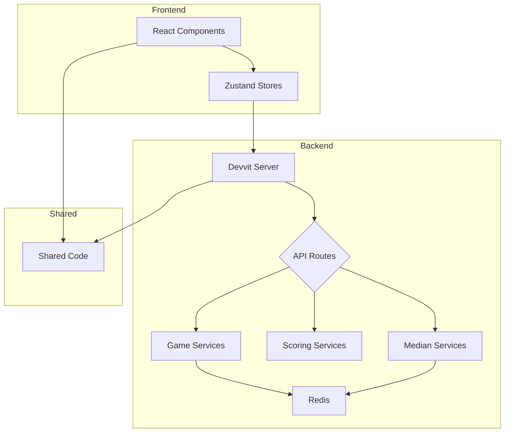

```mermaid
graph TD
    subgraph Frontend
        A[React Components] --> B[Zustand Stores];
    end

    subgraph Backend
        C[Devvit Server] --> D{API Routes};
        D --> E[Game Services];
        D --> F[Scoring Services];
        D --> G[Median Services];
        E --> H[Redis];
        G --> H;
    end

    subgraph Shared
        I[Shared Code]
    end

    B --> C;
    C --> I;
    A --> I;
```
