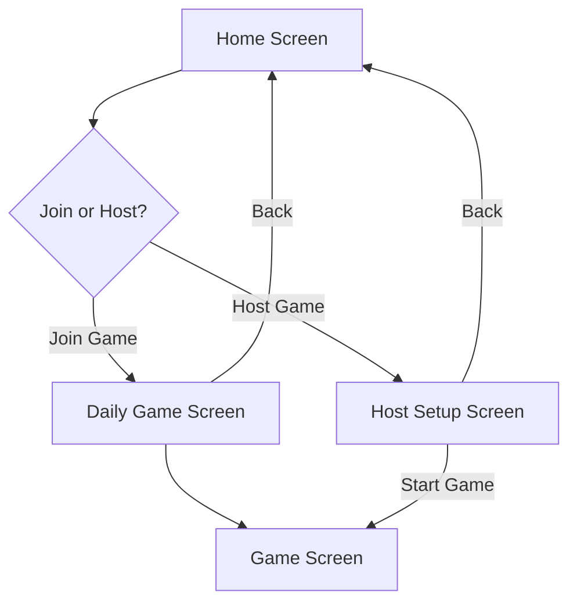

```mermaid
graph TD
    A[Home Screen] --> B{Join or Host?};
    B -- Join Game --> C[Daily Game Screen];
    B -- Host Game --> D[Host Setup Screen];
    C --> E[Game Screen];
    D -- Start Game --> E;
    C -- Back --> A;
    D -- Back --> A;
```
